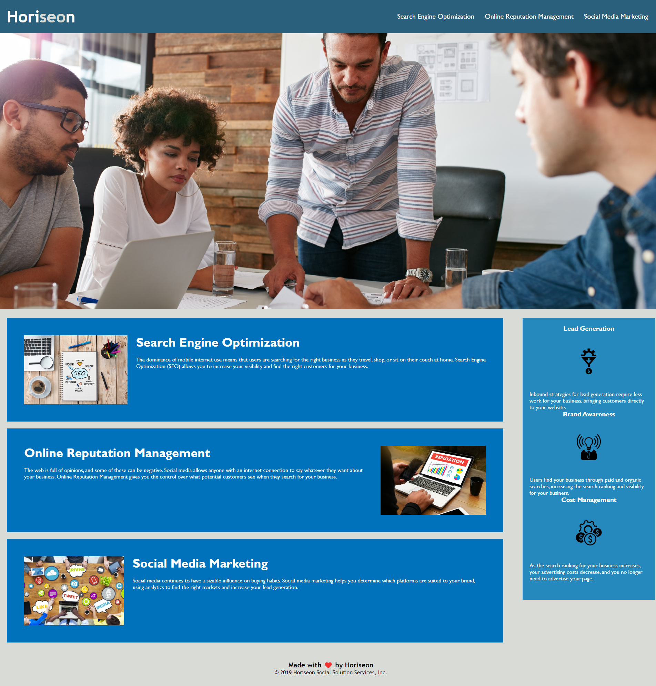

Explanation of Website
July 28, 2022

The marketing agenecy, Horiseon, is devloping a codebase that follows accessibility standards so that the site is optimized for search engines.

Horiseaon's goal is to make the website accesible for all users.
Horiseason wished to give its page abilities to navigate to different sections.

The documents within contain Horiseon's website standards.

Horiseon's Website can be found here:
https://mattflug.github.io/Horiseon-Site/

Below is an image of the porfolio.

